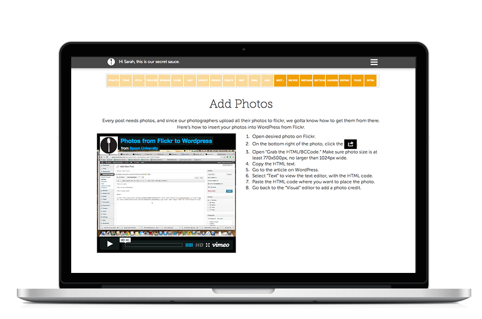

#SECRET SAUCE

##Orientation to Spoon Univeristy
An internal e-training tool that functions as the orientation for all student members, tracks their progress, and provides networking resources and ideas throughout their time at Spoon University. 

[Spoon University](http://www.spoonuniversity.com) is a food website and network for college students, with over 600 contributing students on more than 30 college campuses from coast to coast. Check out recipes, restaurant reviews, kitchen tips and food news — all written for college students, by college students.

## Users
Each staff member gets a personalized experience based on their role at Spoon University.

* Members have access to their personal track (like codecademy).
       
  *  Track for editorial members
       
  *  Track for photography members
       
  *  Track for marketing members
       
* Members can view the pages of all of the other schools
       
* Members have contact information for the entire Spoon U community
  * There are videos on how to complete certain tasks
      
  * Chapter leaders can check on the progress of their team
      
* Members of the administrative team have extra access
  * view the progress of their team
 
##URL
Secret Sauce is hosted on Heroku: http://spoonuniversityx.com

##Implementation
Secret Sauce is built with on Rails with a PostgreSQL database. See sample code below. It uses RESTful and custom routes to deliver the educational track experience and allow users to quickly reference important pages. Backbone.js and D3 were implemented to enliven the user experience through animations and in-page quizzes. 
  

Custom routes for the positions controller:
```ruby
class PositionsController < ApplicationController
	before_filter :authenticate_user!


	def index
		@positions = Position.all
	end

	def position
		@position = Position.find_by_shortname(params[:position])
		@page = Page.find_by_shortname(params[:page])
		current_user.update_completion(@position, @page)
	end

	def next
		track = params[:track]		
		page = Page.find_by_shortname(params[:page])
		position = Position.find(params[:position])
		page = position.next_page(page)
		if page == nil
			redirect_to agreement_path
		else
			redirect_to "/#{track}/#{position.shortname}/#{page.shortname}" 
		end
	end

	def agreement
		if current_user.agreed == true
			redirect_to root_path
		end
	end

	def agree
		current_user.agreed = true
		current_user.save!
		redirect_to thanks_path
	end

	def skill
		skill = params['shortname']
		render "positions/skills/#{skill}"
	end

	def skills
		redirect_to "/#{current_user.track}/#{current_user.position.shortname}/extra_skills" 
	end


end
```


RSpec tests for the User model:
```ruby
 describe "after viewing all the photographer pages" do
        before do
          @position.pages.all.each do |page|
            @user.update_completion(@position, page)
          end
        end
        it "last page should be nil" do
          @user.last_page.should === @position.pages.last
        end
        
        it "should have finished the track" do
          @user.should be_finished_track
        end

        it "current page should be the status's last page" do
          @user.current_page.should == @position.pages.first
        end

      end
```

### Gems and APIs used: 
* Mailchimp 
* Gibbon 
* Sass
* Uglifier
* Coffee
* jQuery
* Turbolinks
* Devise
* Seed_dump
* Font-awesome 
* Handlebars
* jBuilder
* sdoc
* RSpec-rails
* Capybara
* Rails_12factor 

## Contact
Please contact Sarah Adler (sarah@spoonuniversity.com) or Yelena Niznik (yniznik@gmail.com) with questions. 


####Thanks for visiting!!
